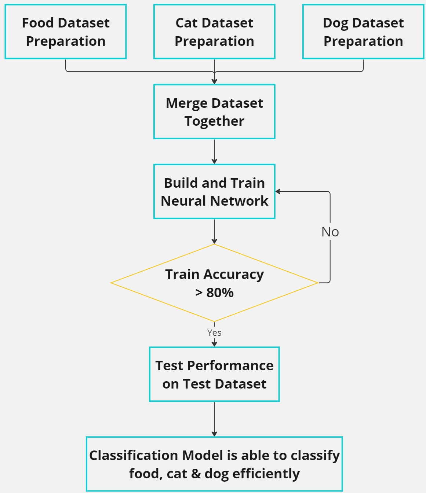

# Food Cat Dog Classification
Author: [Ng Zheng Jue](https://github.com/xinjue37), [Ong Ming Jie](https://github.com/ethanong98), Tan Shan Yong

* This is a project developed in undergraduate Year 1 - Semester 2. 
* It is a Food Cat Dog Classifier implemented using Artificial Neural Network, ANN with a base layer (MobileNetV2) using **[Tensorflow Keras](https://www.tensorflow.org/guide/keras)**.
* This repository consists
  - list of Python code about the preparation of dataset, training and testing of the model, and finally use of the model to classify imaget
  - Image folder that contains some sample test image

## Experiment Design

